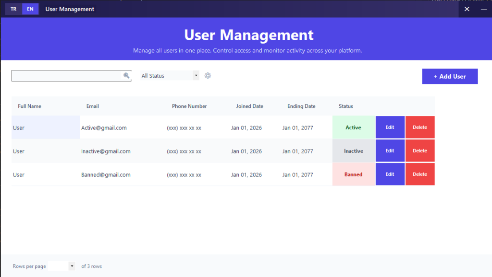
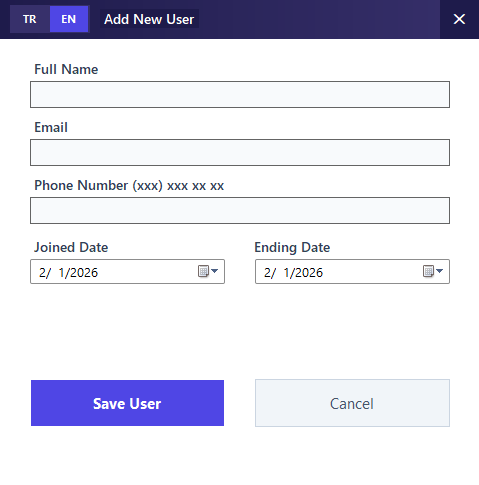
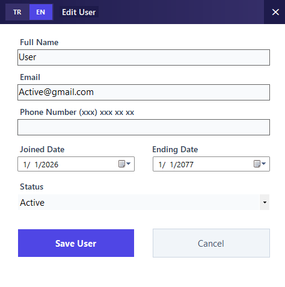

# User Management System

## Overview
**User Management System** is a modern, Windows Forms-based application designed to streamline the administration of user accounts. It provides a comprehensive interface for viewing, searching, filtering, and managing user data with a clean and intuitive user experience.

> **Note:** This project demonstrates a robust implementation of CRUD operations, custom UI controls, and dynamic localization in a .NET environment.

## Key Features

### 🛠 User Administration
*   **CRUD Operations:** Create, Read, Update, and Delete user profiles effortlessly.
*   **Data Validation:** Ensures data integrity with comprehensive input validation for forms.
*   **Status Management:** Manage user statuses (Active, Inactive, Banned) with ease.

### 🔍 Search & Filtering
*   **Smart Search:** Instantly find users by Name, Email, or Phone number.
*   **Status Filters:** Quickly filter the user list by their current status.
*   **Pagination:** Efficiently handles large datasets with built-in pagination controls.

### 🎨 Modern User Interface
*   **Custom UI:** Features a completely custom-drawn Title Bar with window controls.
*   **Borderless Design:** A sleek, frameless window style for a contemporary look.
*   **Responsive Layout:** Clean grid layout with styled headers and rows.

## Screenshots

| Login Screen | Dashboard |
| :---: | :---: |
|  |  |

| Add User | Edit User |
| :---: | :---: |
|  |  |

### Prerequisites
*   Visual Studio 2019 or newer
*   .NET Framework 4.7.2 Developer Pack

### Installation
1.  Clone the repository:
    ```bash
    git clone https://github.com/Nwexy/User-Management-App
    ```
2.  Open **UserManagement.sln** in Visual Studio.
3.  Restore NuGet packages (if prompted).
4.  Build the solution (`Ctrl + Shift + B`).
5.  Run the application (`F5`).

## Usage

# Username : nwexy | Password : nwexy

1.  **Login:** Use the default admin credentials (if prompted/implemented) to access the dashboard.
2.  **Dashboard:** View the list of all users. Use the search bar at the top or the dropdown to filter by status.
3.  **Add User:** Click the **"+ Add User"** button to open the registration form.
4.  **Edit/Delete:** Use the action buttons in the grid rows to modify or remove specific users.

## Project Structure
*   **Forms:** Contains the UI windows (MainForm, UserForm, LoginForm).
*   **Controls:** Custom user controls (e.g., CustomTitleBar).
*   **Data:** Handles data storage and operations (UserRepository).
*   **Models:** Data models defining the User structure.
